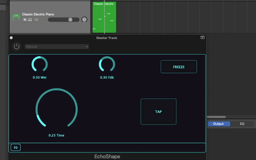

# EchoShape

EchoShape is an experimental delay effect that places a **graphic EQ inside the feedback loop** of the delay.

  

Unlike a conventional EQ applied to the final output, the EQ shapes the signal that is fed back into the delay. As a result, the frequency content of the delay tail can change progressively from one repetition to the next.

The effect can therefore be used to create evolving echo tails, where particular frequency regions gradually become attenuated or emphasized as the sound continues to circulate through the delay.

### Freeze

EchoShape also includes a **Freeze** function that pushes the feedback towards unity, allowing the current delay content to persist for a very long time. The EQ can then be used to shape the spectral evolution of the resulting sustained tail.

EchoShape is an experimental project exploring the interaction between **delay, feedback, and spectral shaping**.

More information and demonstrations:

* https://youtu.be/rhNNRsexdyw
* https://musicalogic.wordpress.com/2026/09/22/echoshape-shape-the-echo-and-what-if-it-doesnt-end/

Part of the **MusicaLogic** experimental VST collection.

<!-- 

ffmpeg -i echo_shape_youtube_video.mp4 \
  -vf "fps=7,scale=420:-1:flags=lanczos,split[s0][s1];[s0]palettegen[p];[s1][p]paletteuse" \
  -loop 0 echoshape-demo.gif

 -->